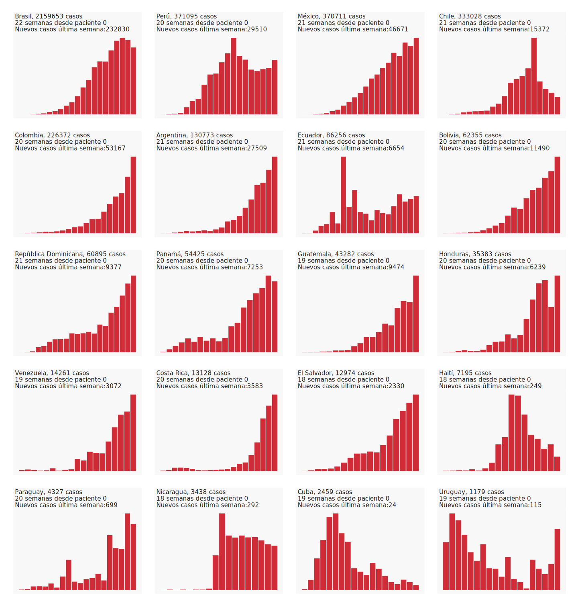
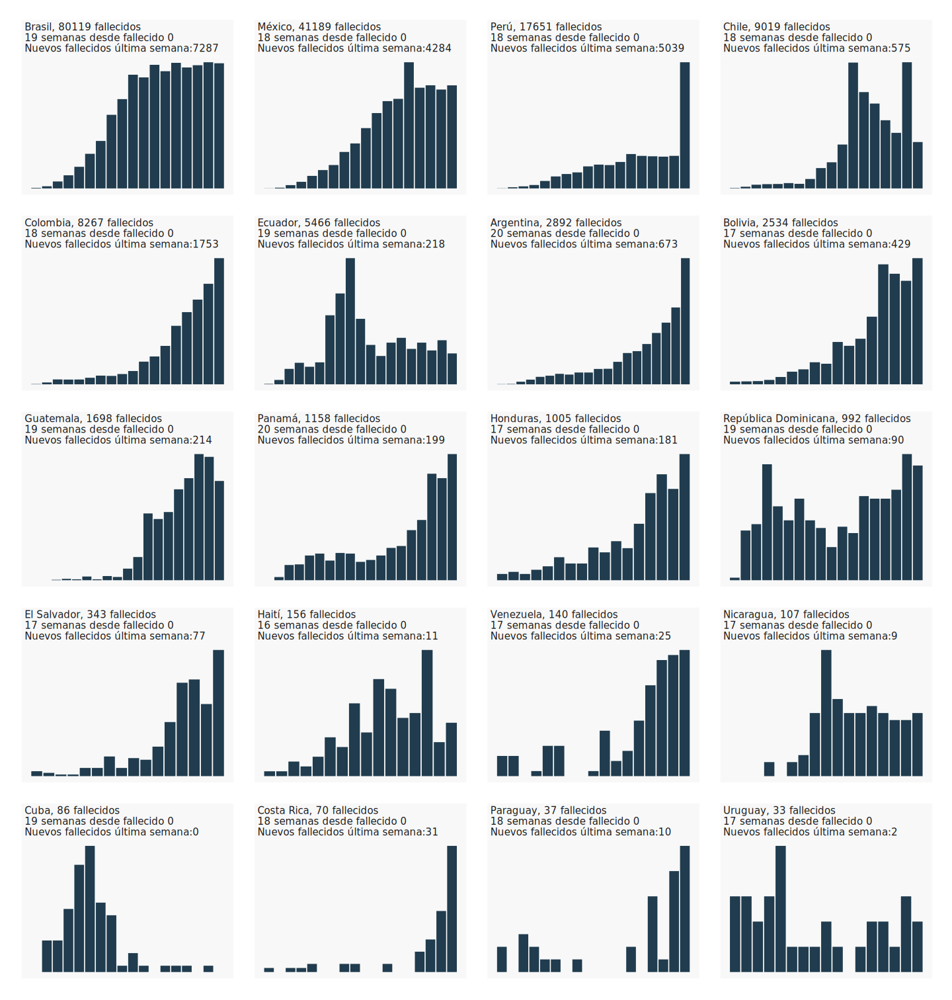

```{r setup, include=FALSE}
knitr::opts_chunk$set(echo = TRUE)
library(gt)
library(reactable)
library(repmis)
library(dplyr)
library(knitr)

source("code/graficos_latam.R")

```


<center><b><h1>Estado de situación del COVID-19 en América Latina</h1></b></center>
<br>
<center>[Juan Cristóbal Birbuet](https://www.linkedin.com/in/juan-cristóbal-birbuet-rosazza-b563208/) & [Rafael López V.](https://rafalopezv.io/about/)</center>
<br>
<center>Última actualización: `r format(Sys.time(), '%d %B, %Y. %X  %Z')`</center>
<br>
<br>
<br>

<center><h1>Número de reproducción dependiente del tiempo (Rt) en la última semana en base a **casos confirmados**</h1></center>
<center><b><h3>Gráfico interactivo: Pase el mouse sobre el gráfico para mayor información.</h3></b></center>
<br>
<iframe frameBorder="0" src="img/rt_latam_confirmados.html" width="100%" height="700" allowtransparency="true"></iframe>
<br>
<br>
<br>
<center><b><h1>Número de reproducción dependiente del tiempo (Rt) en la última semana en base a  **fallecidos**</h1></b></center>
<center><b><h3 style="font-family: Source Code Pro;">Gráfico interactivo: Pase el mouse sobre el gráfico para mayor información.</h3></b></center>
<br>
<iframe frameBorder="0" src="img/rt_latam_fallecidos.html" width="100%" height="700" allowtransparency="true"></iframe>
<br>
<br>
<br>
<center><b><h1>Serie de tiempo dl número de reproducción dependiente del tiempo (Rt) por semana y por país desde el primer confirmado y fallecido  </h1></b></center>
<center><b><h3 style="font-family: Source Code Pro;">Gráfico interactivo: Pase el mouse sobre el gráfico para mayor información.Puede desactivar las categoría de confirmados o fallecidos</h3></b></center>
<br>
<iframe frameBorder="0" src="img/argentina.html" width="100%" height="200" allowtransparency="true"></iframe>

<iframe frameBorder="0" src="img/bolivia.html" width="100%" height="200" allowtransparency="true"></iframe>

<iframe frameBorder="0" src="img/brasil.html" width="100%" height="200" allowtransparency="true"></iframe>

<iframe frameBorder="0" src="img/chile.html" width="100%" height="200" allowtransparency="true"></iframe>

<iframe frameBorder="0" src="img/colombia.html" width="100%" height="200" allowtransparency="true"></iframe>

<iframe frameBorder="0" src="img/costa_rica.html" width="100%" height="200" allowtransparency="true"></iframe>

<iframe frameBorder="0" src="img/cuba.html" width="100%" height="200" allowtransparency="true"></iframe>

<iframe frameBorder="0" src="img/ecuador.html" width="100%" height="200" allowtransparency="true"></iframe>

<iframe frameBorder="0" src="img/el_salvador.html" width="100%" height="200" allowtransparency="true"></iframe>

<iframe frameBorder="0" src="img/guatemala.html" width="100%" height="200" allowtransparency="true"></iframe>

<iframe frameBorder="0" src="img/haiti.html" width="100%" height="200" allowtransparency="true"></iframe>

<iframe frameBorder="0" src="img/honduras.html" width="100%" height="200" allowtransparency="true"></iframe>

<iframe frameBorder="0" src="img/mexico.html" width="100%" height="200" allowtransparency="true"></iframe>

<iframe frameBorder="0" src="img/nicaragua.html" width="100%" height="200" allowtransparency="true"></iframe>

<iframe frameBorder="0" src="img/panama.html" width="100%" height="200" allowtransparency="true"></iframe>

<iframe frameBorder="0" src="img/paraguay.html" width="100%" height="200" allowtransparency="true"></iframe>

<iframe frameBorder="0" src="img/peru.html" width="100%" height="200" allowtransparency="true"></iframe>

<iframe frameBorder="0" src="img/republica_dominicana.html" width="100%" height="200" allowtransparency="true"></iframe>

<iframe frameBorder="0" src="img/uruguay.html" width="100%" height="200" allowtransparency="true"></iframe>

<iframe frameBorder="0" src="img/venezuela.html" width="100%" height="200" allowtransparency="true"></iframe>
<br>
<br>
<br>
<center><b><h1>Nuevos casos *confirmados* por día desde paciente '0' en cada país</h1></b></center>
<center><b><h3>Gráfico interactivo: Pase el mouse sobre el gráfico y seleccione, en la parte de abajo, los países que quiera comparar. El ancho de cada color determina la proporción de ese país sonbre el total</h3></b></center>


<iframe frameBorder="0" src="img/incidencia_confirmados_latam.html" width="100%" height="700" allowtransparency="true"></iframe></iframe>
<a href="https://rafalopezv.io/static/avina/incidencia_confirmados_latam.html" target="_blank"><font size="2">ver en pantalla completa</font></a>
<br>
<br>
<center><b><h1>Casos confirmados *acumulados* por día desde paciente '0' en cada país</h1></b></center>
<center><b><h3>Gráfico interactivo: Pase el mouse sobre el gráfico y seleccione, en la parte de abajo, los países que quiera comparar.El ancho de cada color determina la proporción de ese país sonbre el total</h3></b></center>

<iframe frameBorder="0" src="img/prevalencia_confirmados_latam.html" width="100%" height="700" allowtransparency="true"></iframe><a href="https://rafalopezv.io/static/avina/prevalencia_confirmados_latam.html" target="_blank"><font size="2">ver en pantalla completa</font></a>

<br>
<br>
<center><b><h1>Nuevos casos de *fallecidos* por día desde fallecido '0' en cada país</h1></b></center>
<center><b><h3 style="font-family: Source Code Pro;">Gráfico interactivo: Pase el mouse sobre el gráfico y seleccione, en la parte de abajo, los países que quiera comparar.El ancho de cada color determina la proporción de ese país sonbre el total</h3></b></center>

<iframe frameBorder="0" src="img/incidencia_fallecidos_latam.html" width="100%" height="700" allowtransparency="true"></iframe></iframe><a href="img/incidencia_fallecidos_latam.html" target="_blank"><font size="2">ver en pantalla completa</font></a>

<br>
<br>
<center><b><h1>Fallecidos acomulados por día desde fallecido '0' en cada país</h1></b></center>
<center><b><h3>Gráfico interactivo: Pase el mouse sobre el gráfico y seleccione, en la parte de abajo, los países que quiera comparar.El ancho de cada color determina la proporción de ese país sonbre el total</h3></b></center>

<iframe frameBorder="0" src="img/prevalencia_fallecidos_latam.html" width="100%" height="700" allowtransparency="true"></iframe></iframe></iframe><a href="img/prevalencia_fallecidos_latam.html" target="_blank"><font size="2">ver en pantalla completa</font></a>

<br>
<br>
<br>
<center><b><h1>¿Dónde se está aplanando la curva?</h1></b></center>
<center><b><h2>Nuevos casos confirmados confirmados por semana</h2></b></center>


<br>
<br>
<br>
<center><b><h2>Nuevos casos fallecidos confirmados por semana</h2></b></center>



<center><b><h1>Metodología sobre Rt</h1></b></center>

<small>
<br>

Para evaluar la velocidad de propagación del covid-19, se estimó Rt empleando el método desarrollado por [Cori et al, 2013](https://academic.oup.com/aje/article/178/9/1505/89262).  Se ha incluido una descripción detallada del método en el anexo metodológico. Utilizamos el paquete EpiEstim R para estimar Rt en intervalos de tiempo de una semana. Rt representa el número de casos secundarios que surgen a partir de un individuo infectado en un intervalo de tiempo determinado, suponiendo que las condiciones permanecen idénticas en el siguiente intervalo de tiempo y, por lo tanto, es una medida de la transmisibilidad instantánea.

 
Un parámetro crítico para la modelación y cálculo de Rt es la definición del Intervalo en Serie (SI). El SI es el tiempo que transcurre entre el inicio de los síntomas del caso primario y el inicio de los síntomas en el caso secundario. El SI tiene una distribución estadística que se simula empleando una distribución gamma con una media de 6.48 y una desviación estándar de 3.83 (la media y la desviación estándar utilizadas se obtuvieron del Short-term forecasts of COVID-19 deaths in multiple countries, efectuado por el [Imperial College London](https://mrc-ide.github.io/covid19-short-term-forecasts/index.html#projections-and-effective-reproduction-number-estimates).
<br>
<center><h3>Descargar anexo metodológico</h3></center>
</small>

<br>
<center>[](https://rafalopezv.io/static/avina/anexo_jcb_rlv.pdf)</center>
<br>
<br>
<center><h1>Acceder al código de programación</h1></center>
<br>
<center>[](https://rafalopezv.io/static/avina/anexo_jcb_rlv.pdf)</center>
<br>

<center><b><h1>Créditos respecto a librerías utilizadas</h1></b></center>
<br>
Esta página y todos sus contenidos son posibles por la contribución de las siguientes librerías del lenguaje R.

# References


